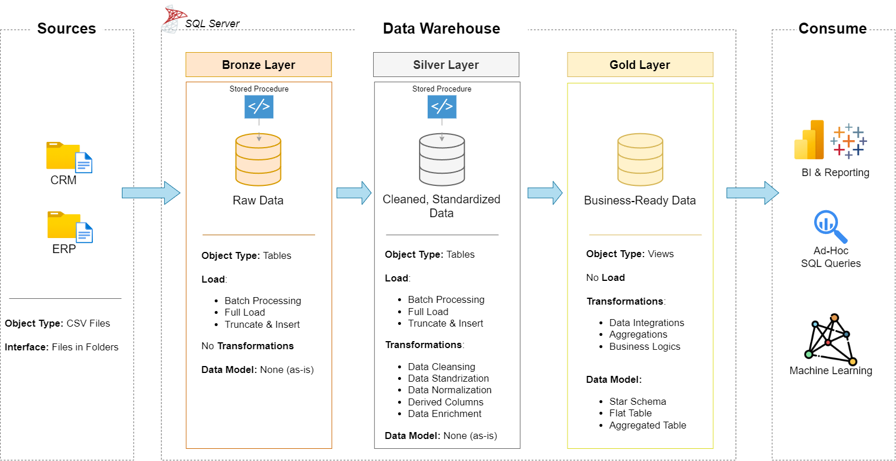

# 📊 SQL Data Warehouse Project

## 🚀 Overview
This project builds a Data Warehouse using SQL Server with 3 layers:

- 🥉 Bronze → Raw data (CSV load)
- 🥈 Silver → Cleaned data
- 🥇 Gold → Business-ready data

---

## 🏗️ Architecture


---

```## 📂 Project Structure
sql-data-warehouse-project/
│
├── datasets/              # Source CSV files
├── scripts/
│   ├── bronze/            # Raw data loading
│   ├── silver/            # Data transformation
│   ├── gold/              # Analytical views
│   └── init_database.sql  # Database setup
│
└── README.md
```
---

## How to Run

-- Step 1: Setup database
init_database.sql

-- Step 2: Load Bronze layer
EXEC bronze.load_bronze;

-- Step 3: Load Silver layer
EXEC silver.load_silver;

-- Step 4: Query Gold layer
SELECT * FROM gold.fact_sales;

---

## 📊 Data Model
- 📌 fact_sales  
- 📌 dim_customers  
- 📌 dim_products  

---

## 🔥 Features
- ⚡ ETL Pipeline  
- 🧹 Data Cleaning  
- ⭐ Star Schema  
- 🛠️ SQL Transformations  

---

## 👨‍💻 Author
Shivam Jaiswal
